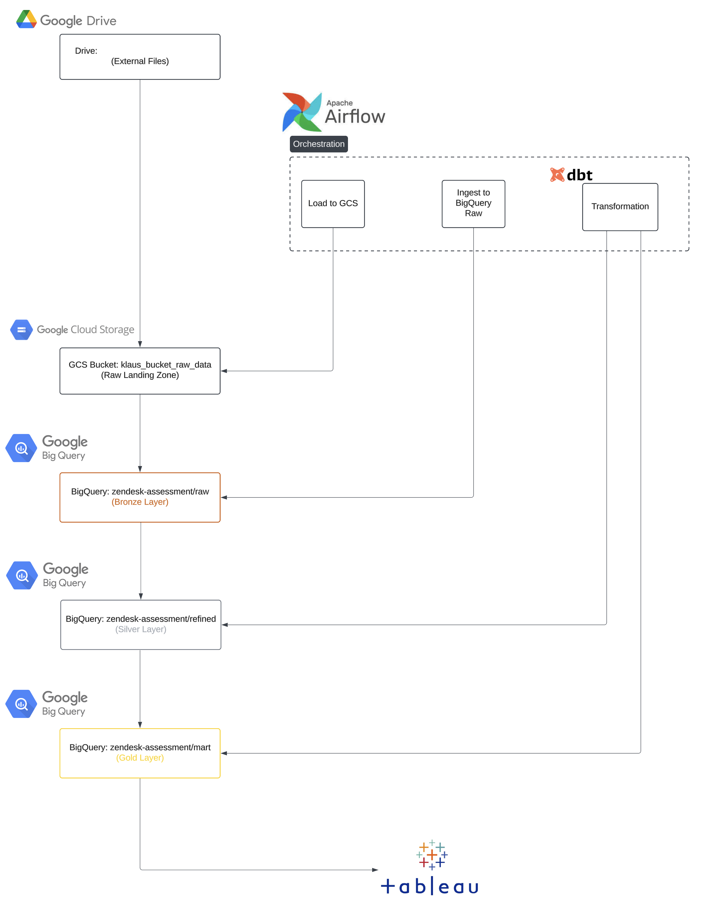

# QA Pipeline - Klaus Data Engineer Project

**Repo**: [github.com/mosesobeng/qa_pipeline](https://github.com/mosesobeng/qa_pipeline)

This file provides a top-level overview of the entire solution, referencing detailed documentation and code.

---

##  Project Overview

Below is a high-level project layout:

- **airflow/**:
  - DAGs: 
    - `ingestion_gdrive_to_gcs.py`: Ingest Assessment ZIP data from Google Drive to GCS.
    - `ingestion_quality_assurance.py`: Load raw CSV to BigQuery.
    - `ingestion_customer_subscriptions.py`: JSON ingestion to BigQuery.
    - `transformation_data_warehouse.py`: Orchestrates dbt transformations.
- **dbt/**:
  - `models/marts/*`: Dimensions and Fact SQL models (e.g. `dim_team.sql`, `fact_autoqa_reviews.sql`).
  - `models/staging/*`: Staging references to raw tables (e.g. `stg_autoqa_reviews.sql`).
  - `schema.yml`, `sources.yml`: Testing & source definitions.
- **diagram/**:
  - `erd_non_modeled.mmd`, `erd_modeled.mmd`: Mermaid files for the ERDs.
- **docs/**:
  - `images/*`: Rendered images (ERDs, pipeline diagrams).
- **scripts/**:
    - `*.sql`: sql queries.

> Technology Stack and Flow Overview
---

##  Ingestion & Medallion Layers

The assessment source zip file is ingested from the orginal google drive path and placed in a GCS bucket (the “**raw**” layer). Then load into `zendesk-assessment.raw` BigQuery dataset with minimal changes. Optionally transform or refine data in the `zendesk-assessment.refined` dataset (silver). Final dimensional or fact tables live in `zendesk-assessment.dw` (gold).

### Key DAGs
1. **`ingestion_gdrive_to_gcs.py`**: A single-step PythonOperator to download & unzip.  
2. **`ingestion_quality_assurance.py`**: Parallel load multiple csv from GCS → BigQuery.  
3. **`ingestion_customer_subscriptions.py`**: Incremental ingests JSON `etl.json` data.  
4. **`transformation_data_warehouse.py`**: Runs dbt to incrementally build models for the gold layer 

For more detail, see:
 **[Doc: Data Ingestion](docs/data_ingestion.md)**

---

##  Data Modeling

The data modeling process in this project is divided into two main phases:

1. **Preliminary Analysis of Relationships**:
   - Explores relationships between six base tables without applying dimensional modeling techniques.
   - Key relationships include:
     - `autoqa_reviews` ↔ `autoqa_ratings` ↔ `autoqa_root_cause`
     - `autoqa_reviews` ↔ `conversations`
     - `conversations` ↔ `conversation_messages` and `conversation_surveys`
   - An Entity-Relationship Diagram (ERD) for this phase is available in the [non-modeled ERD](docs/images/erd_non_modeled.png) and [non-modeled ERD code](diagram/erd_non_modeled.mmd).

2. **Dimensional Modeling**:
   - Optimizes the structure for analytics by organizing data into fact and dimension tables.
   - A second ERD, reflecting the dimensional model, is provided in the [modeled ERD](docs/images/erd_modeled.png) and [modeled ERD code](diagram/erd_modeled.mmd).

> The Mermaid code for this model lives in `diagram/erd_modeled.mmd`.

For more detail, see:
 **[Doc: Data Modeling](docs/data_model.md)**

---

##  Data Model Implementation

I rely on **incremental** logic with `unique_key` in each dimension/fact. This allows partial loads, merges new columns, and handles schema changes. I test each model with not_null, unique, and relationship constraints in `schema.yml`.

> The dbt code for this lives in `airflow/dags/dbt/models/marts` and airflow dag is `airflow/dags/transformation_data_warehouse.py`.

For more detail, see:
 **[Doc: Data Model Implementation](docs/data_model_implementation.md)**

---

##  Queries 

SQL related queries for task `A3` are found in **[Dir: Scripts](scripts/)**

---

##  Data Pipeline for `etl.json`

One DAG processes the nested JSON (`etl.json`) from GCS. I flatten it with `pd.json_normalize` for simplicity. More advanced usage might split out sub-objects into separate tables. The pipeline also merges records incrementally, ensuring only changed or new data is updated.

For more detail, see:
 **[Doc: ETL JSON Data Pipeline](docs/data_pipeline_for_json_file.md)**

---
##  Future Consideration 

###  Future-Proofing 

- The pipeline uses `Airflow` + `dbt Core` + `BigQuery` in a layered approach, promoting modularity.  
- Containerization (`Docker`, `Kubernetes`) ensures scalable deployment and avoids cloud lock-in.  
- Proper partitioning and strong data governance practices help keep the architecture resilient and cost-effective as data volumes rise.

---

###  Machine Learning Integration

- Container-based ML pipelines can ingest refined data, train models, and serve predictions in a flexible and cloud-agnostic manner.  
- Potential solutions include sentiment analysis models, predictive scoring, and time series forecasting—integrated seamlessly with existing transformations and dashboards.

For more detail, see:
 **[Doc: Future Consideration](docs/data_pipeline_for_json_file.md)**

---

##  Dashboard 

- Dashboards was built in `Tableau Public` against the **Gold** BigQuery tables for streamlined access to curated, business-ready data.  
- Visualizations focus on ticket scores, reviewer performance, root causes, and time-based trends.  
- Documentation captures the rationale behind each metric and chart type.

For more detail, see:
 **[Doc: Dashboarding](docs/dashboarding.md)**

- **[LINK: Dashboard ](https://public.tableau.com/app/profile/moses.obeng/viz/qa_dashboard_/Overview?publish=yes)**

---

## 7. Quick Evaluation

1. **Airflow**:  
   - Deploy the DAGs (`ingestion_*.py`, `transformation_data_warehouse.py`).  
   - Supply a GCS bucket name and BigQuery credentials.
2. **dbt**:  
   - `cd dbt/`, adjust `profiles.yml` to match BigQuery project, run `dbt run --full-refresh`.  
3. **Validation**:  
   - Use `dbt test`.  
   - Check results in the BigQuery console (`zendesk-assessment.dw` dataset).  

---

