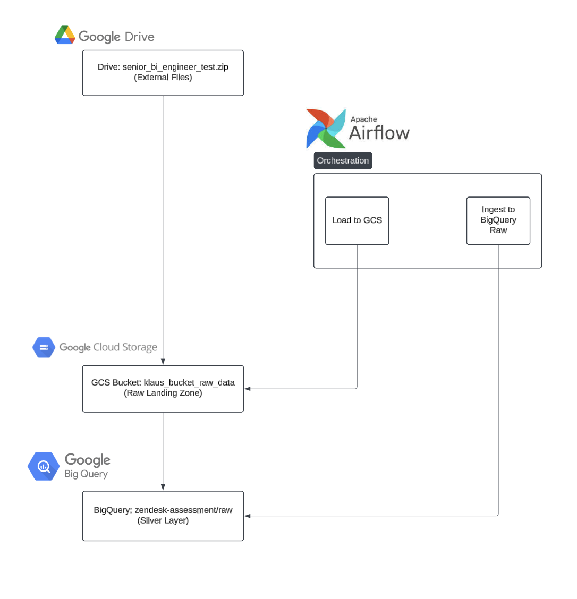

# Ingestion Pipeline Documentation

This document outlines an Ingestion pipeline on **Google Cloud** that:
1. Pulls source assignment files from an external location (Google Drive).
2. Lands them in a Google Cloud Storage (GCS) bucket (raw layer).
3. Loads them into **BigQuery** using a **medallion**-style architecture:
   - **Raw** (BigQuery “raw” dataset)
   - **Staging** (BigQuery “silver” dataset)
   - **Curated/Mart** (BigQuery “gold” dataset)

## 1. Brief Overview

The ingestion pipeline is composed of two main DAGs:
- **DAG** (for ingestion from Google Drive into GCS).
- **DAG** (for loading from GCS into BigQuery “raw” and only ingestion level transformations).

### Ingestion Pipeline Diagram 

*(You can store or reference any relevant .png/.jpg here, for example `./images/airflow_pipeline_architecture.png`.)*

## 2. Pipeline Steps

1. **Source (Google Drive)**  
   - Source files are provided as ZIP archives.
   - This data can arrive at varying times or might change structure over time.

2. **Landing in GCS (Raw Layer)**  
   - Files are **downloaded** and **extracted** into a GCS bucket, e.g. `klaus_bucket_raw_data`.
   - Retain the original structure for future reprocessing or troubleshooting.

3. **Loading to BigQuery (Raw Dataset)**  
   - Load the exact CSV content from GCS into a BigQuery dataset called “raw” (e.g. `zendesk-assessment.raw`).  
   - This step ensures we have an immutable snapshot of the data, with minimal transformation.

4. **Optional Staging (Silver) and Curated (Gold) Steps**  
   - **Staging**: A “silver” dataset in BigQuery, where data might be cleaned or lightly standardized (often done with dbt).
   - **Curated/Mart**: A “gold” dataset in BigQuery for analytics, using star schemas or dimensional models. This is where the final “modeled data” lives.

## 3. Benefits of the Medallion Architecture

- **Raw** layer (GCS + BigQuery “raw”): 
  - Keeps data exactly as ingested, supporting schema evolution and easy reprocessing.
- **Staging** layer (BigQuery “silver”): 
  - Allows for iterative transformations or normalization steps without overwriting raw data.
- **Curated** / “Gold” layer (BigQuery “mart”):
  - Business-ready tables for analytics; the final dimensional models or star schemas.

## 4. Schema Evolution and Importance

- **Schema evolution** implies the source data can gain new columns or shift data types.  
- Storing the original data in GCS (as CSV) and in a flexible BigQuery “raw” dataset allows adapting to these changes:
  - We can parse or ignore newly introduced columns in staging transformations.
  - We don’t lose historical data if the source changes.

## 5. Potential Challenges / Best Practices

- **Managing Large Files**: Large ZIP or CSVs might require chunked processing or memory-efficient approaches.
- **Maintaining Clear Data Lineage**: Always keep track of which version of raw data leads to which transformations.
- **Security & Governance**: GCS bucket access, IAM roles in BigQuery, and service account keys should be carefully secured.
- **Orchestration**: Airflow dependencies can be configured to ensure any transformations wait until raw data load completes.

