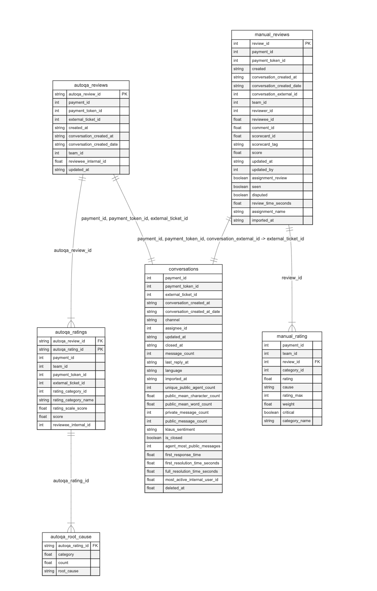

# Data Model Documentation

I’m splitting this into two sections:

1. **Preliminary Analysis of Relationships** (No Dimensional Modeling)  
2. **Dimensional Modeling Overview**

Both diagrams are stored as `.mmd` files in the `diagram/` directory. I’ve converted them into `.png` and placed them under `docs/images/` so they’re easily viewable here in this Markdown.

---

## Preliminary Analysis of Relationships (No Dimensional Modeling)

### Diagram

Here’s the **rendered ERD** showing the **six base tables** in their raw form, with the relevant joins:

> The Mermaid code for this model lives in `diagram/erd_non_modeled.mmd`.

---

In this initial phase, I took six base tables and documented how they could be joined **without** any dimensional modeling:

1. **`autoqa_reviews` → `autoqa_ratings`**  
   - **Key**: `autoqa_review_id`  
   - `autoqa_ratings.autoqa_review_id` references `autoqa_reviews.autoqa_review_id`.  

2. **`autoqa_ratings` → `autoqa_root_cause`**  
   - **Key**: `autoqa_rating_id`  
   - `autoqa_root_cause.autoqa_rating_id` references `autoqa_ratings.autoqa_rating_id`.  

3. **`autoqa_reviews` ↔ `conversations`**  
   - **Match on**: `payment_id`, `payment_token_id`, and `external_ticket_id`.  
   - If these columns match in both tables, they join easily.

4. **`manual_reviews` → `manual_rating`**  
   - **Key**: `review_id`  
   - `manual_rating.review_id` references `manual_reviews.review_id`.

5. **`manual_reviews` ↔ `conversations`**  
   - **Match on**: `payment_id`, `payment_token_id`, plus `conversation_external_id = external_ticket_id`.

This **preliminary analysis** focuses purely on **raw** table relationships. I haven’t reorganized them into a star schema at this point.

---

## Dimensional Modeling Overview (Star Schema)

### Diagram

Below is the **rendered ERD** for my **star schema** design:

> The Mermaid code for this model lives in `diagram/erd_modeled.mmd`.

---

I’m transforming the original six base tables into **dimensions** (describing business objects) and **facts** (representing measurements).

---

### 1. Dimensions (Entities)

#### 1.1 **DimTeam**
- **Purpose**: Holds team-related data.
- **Grain**: One row per `team_id`.
- **Surrogate Key (Primary Key)**: `team_key`
- **Natural Key**: `team_id`
- **Columns**:
  1. **team_key** *(PK, surrogate)*  
  2. **team_id** *(int)*  
  3. **updated_at** *(timestamp/string)* if available

---

#### 1.2 **DimPayment**
- **Purpose**: Stores payment identifiers.
- **Grain**: One row per `payment_id`.
- **Surrogate Key (Primary Key)**: `payment_key`
- **Natural Key**: `payment_id`
- **Columns**:
  1. **payment_key** *(PK, surrogate)*  
  2. **payment_id** *(int)*  
  3. **payment_token_id** *(int)*  
  4. **updated_at** *(timestamp/string)* if used

---

#### 1.3 **DimUser**
- **Purpose**: Centralizes user references (reviewers, reviewees, assignees, etc.).
- **Grain**: One row per user identifier.
- **Surrogate Key (Primary Key)**: `user_key`
- **Natural Key**: `user_id`
- **Columns**:
  1. **user_key** *(PK, surrogate)*  
  2. **user_id** *(int)*  
  3. **updated_at** *(timestamp/string)* optional

---

#### 1.4 **DimRatingCategory**
- **Purpose**: Consolidates categories from manual and auto QA ratings.
- **Grain**: One row per category identifier.
- **Surrogate Key (Primary Key)**: `rating_category_key`
- **Natural Key**: `category_id`
- **Columns**:
  1. **rating_category_key** *(PK, surrogate)*  
  2. **category_id** *(int)*  
  3. **category_name** *(string)*

---

### 2. Fact Tables (Entities)

Each fact references dimension keys.  

#### 2.1 **FactAutoQAReviews**
- **Source Table**: `autoqa_reviews`
- **Grain**: One row per *Auto QA review*.
- **Primary Key**: `autoqa_review_key`
- **Columns**:
  1. **autoqa_review_key** *(PK, surrogate)*  
  2. **autoqa_review_id** *(string)*  
  3. **payment_key** *(FK to DimPayment)*  
  4. **payment_id** *(int)* optional  
  5. **payment_token_id** *(int)* optional  
  6. **external_ticket_id** *(int)*  
  7. **created_at** *(string/timestamp)*  
  8. **conversation_created_at** *(string/timestamp)*  
  9. **conversation_created_date** *(string/date)*  
  10. **team_key** *(FK to DimTeam)*  
  11. **team_id** *(int)* optional  
  12. **reviewee_key** *(FK to DimUser)*  
  13. **reviewee_internal_id** *(float)* optional  
  14. **updated_at** *(string/timestamp)*  

---

#### 2.2 **FactAutoQARatings**
- **Source Table**: `autoqa_ratings`
- **Grain**: One row per *Auto QA rating line*.
- **Primary Key**: `autoqa_rating_key`
- **Columns**:
  1. **autoqa_rating_key** *(PK, surrogate)*  
  2. **autoqa_rating_id** *(string)*  
  3. **autoqa_review_key** *(could reference FactAutoQAReviews)*  
  4. **payment_key** *(FK to DimPayment)*  
  5. **payment_id** *(int)* optional  
  6. **team_key** *(FK to DimTeam)*  
  7. **team_id** *(int)* optional  
  8. **payment_token_id** *(int)* optional  
  9. **external_ticket_id** *(int)*  
  10. **rating_category_key** *(FK to DimRatingCategory)*  
  11. **rating_category_id** *(int)*  
  12. **rating_category_name** *(string)*  
  13. **rating_scale_score** *(float)*  
  14. **score** *(float)*  
  15. **reviewee_key** *(FK to DimUser)*  
  16. **reviewee_internal_id** *(int)* optional

---

#### 2.3 **FactAutoQARootCause**
- **Source Table**: `autoqa_root_cause`
- **Grain**: One row per *root cause record*.
- **Primary Key**: `autoqa_root_cause_key`
- **Columns**:
  1. **autoqa_root_cause_key** *(PK, surrogate)*  
  2. **autoqa_rating_key** *(FK to FactAutoQARatings)*  
  3. **autoqa_rating_id** *(string)* optional  
  4. **category** *(float)*  
  5. **count** *(float)*  
  6. **root_cause** *(string)*

---

#### 2.4 **FactManualReviews**
- **Source Table**: `manual_reviews`
- **Grain**: One row per *manual review*.
- **Primary Key**: `manual_review_key`
- **Columns**:
  1. **manual_review_key** *(PK, surrogate)*  
  2. **review_id** *(int)*  
  3. **payment_key** *(FK to DimPayment)*  
  4. **payment_id** *(int)* optional  
  5. **payment_token_id** *(int)* optional  
  6. **created** *(string/timestamp)*  
  7. **conversation_created_at** *(string/timestamp)*  
  8. **conversation_created_date** *(string/date)*  
  9. **conversation_external_id** *(int)*  
  10. **team_key** *(FK to DimTeam)*  
  11. **team_id** *(int)* optional  
  12. **reviewer_key** *(FK to DimUser)*  
  13. **reviewer_id** *(int)* optional  
  14. **reviewee_key** *(FK to DimUser)*  
  15. **reviewee_id** *(float)* optional  
  16. **comment_id** *(float)*  
  17. **scorecard_id** *(float)*  
  18. **scorecard_tag** *(string)*  
  19. **score** *(float)*  
  20. **updated_at** *(string/timestamp)*  
  21. **updated_by** *(int)*  
  22. **assignment_review** *(boolean)*  
  23. **seen** *(boolean)*  
  24. **disputed** *(boolean)*  
  25. **review_time_seconds** *(float)*  
  26. **assignment_name** *(string)*  
  27. **imported_at** *(string/timestamp)*  

---

#### 2.5 **FactManualRatings**
- **Source Table**: `manual_rating`
- **Grain**: One row per *category-level rating* in manual reviews.
- **Primary Key**: `manual_rating_key`
- **Columns**:
  1. **manual_rating_key** *(PK, surrogate)*  
  2. **payment_key** *(FK to DimPayment)*  
  3. **payment_id** *(int)* optional  
  4. **team_key** *(FK to DimTeam)*  
  5. **team_id** *(int)* optional  
  6. **review_id** *(int)*  
  7. **manual_review_key** *(FK to FactManualReviews)* optional  
  8. **category_id** *(int)*  
  9. **rating** *(float)*  
  10. **cause** *(string)*  
  11. **rating_max** *(int)*  
  12. **weight** *(float)*  
  13. **critical** *(boolean)*  
  14. **category_name** *(string)*

---

#### 2.6 **FactConversations**
- **Source Table**: `conversations`
- **Grain**: One row per *conversation*.
- **Primary Key**: `conversation_key`
- **Columns**:
  1. **conversation_key** *(PK, surrogate)*  
  2. **payment_key** *(FK to DimPayment)*  
  3. **payment_id** *(int)* optional  
  4. **payment_token_id** *(int)*  
  5. **external_ticket_id** *(int)*  
  6. **conversation_created_at** *(string/timestamp)*  
  7. **conversation_created_at_date** *(string/date)*  
  8. **channel** *(string)*  
  9. **assignee_key** *(FK to DimUser)*  
  10. **assignee_id** *(int)* optional  
  11. **updated_at** *(string/timestamp)*  
  12. **closed_at** *(string/timestamp)*  
  13. **message_count** *(int)*  
  14. **last_reply_at** *(string/timestamp)*  
  15. **language** *(string)*  
  16. **imported_at** *(string/timestamp)*  
  17. **unique_public_agent_count** *(int)*  
  18. **public_mean_character_count** *(float)*  
  19. **public_mean_word_count** *(float)*  
  20. **private_message_count** *(int)*  
  21. **public_message_count** *(int)*  
  22. **klaus_sentiment** *(string)*  
  23. **is_closed** *(boolean)*  
  24. **agent_most_public_messages** *(int)*  
  25. **first_response_time** *(float)*  
  26. **first_resolution_time_seconds** *(float)*  
  27. **full_resolution_time_seconds** *(float)*  
  28. **most_active_internal_user_id** *(float)*  
  29. **deleted_at** *(float)*  

---

### 3. Relationships 

Here’s a summary of how the **Facts** link to **Dimensions**:

1. **FactAutoQAReviews** → references **DimTeam** (`team_key`), **DimPayment** (`payment_key`), **DimUser** (`reviewee_key`).  
2. **FactAutoQARatings** → references **DimTeam**, **DimPayment**, **DimUser**, **DimRatingCategory**, optionally **FactAutoQAReviews** (via `autoqa_review_key`).  
3. **FactAutoQARootCause** → references **FactAutoQARatings** by `autoqa_rating_key`.  
4. **FactManualReviews** → references **DimTeam**, **DimPayment**, **DimUser** for reviewer/reviewee.  
5. **FactManualRatings** → references **DimTeam**, **DimPayment**, **DimRatingCategory**, optionally **FactManualReviews** (`review_id` → `manual_review_key`).  
6. **FactConversations** → references **DimPayment**, **DimUser** (for `assignee_key`).

---

### 4. Design Choices

- **Surrogate Keys**: Each dimension gets a generated key (`*_key`) so I don’t rely directly on raw IDs.  
- **Degenerate Dimensions**: Some columns (`team_id`, `payment_id`) also appear in the fact table for convenience.  
- **Separate Facts**: I’m breaking out “AutoQA,” “Manual,” and “Conversations” because they’re distinct processes.  
- **Optional vs. Required**: Columns like `reviewee_internal_id` are only used if present in the raw data.

---

## Conclusion

- **Preliminary Analysis**: Explains how the six base tables link via raw keys (`autoqa_review_id`, `review_id`, etc.).  
- **Dimensional Model**: Reorganizes them into four main dimensions (`DimTeam`, `DimPayment`, `DimUser`, `DimRatingCategory`) and six fact tables (AutoQA, Manual, Conversations).  
- **Future Enhancements**: Could add more columns (like `team_name`, `user_name`), convert string-based dates to `TIMESTAMP`, or implement Slowly Changing Dimensions.

> **Note**: The raw Mermaid `.mmd` files are:  
> - `erd_non_modeled.mmd` (for the preliminary diagram)  
> - `erd_modeled.mmd` (for the star schema)  

They live in the `diagram/` folder. I converted them to `.png` using a Mermaid CLI and placed them in `docs/images/` for easy reference.
